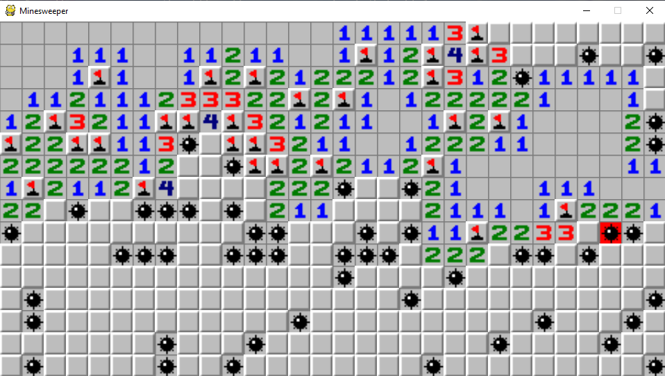

# Minesweeper

This is a recreation of the original Minesweeper game on Windows 3.1, which was first released in 1990.



# Requirements

Both a version of Python 3 and pip needs to be installed for Minesweeper to be ran. 

This project was tested with Python 3.8.2.

# Installation

To install Minesweeper, first clone or download this repository.

Navigate into the directory you installed it in, and run the following shell command to install dependencies.

```
pip install -r requirements.txt
```

# Playing the Game

Run this command to start a game of minesweeper. The default configurations set the board at 30 by 16 with 80 mines.

```
python src/game.py
```

To customize the configurations, you can edit game.py or create a new python script that imports game.py. Then, you can make an instance of the Game class and pass in your own parameters.

```python
import game

Game(WIDTH, HEIGHT, MINE_COUNT).run()
```